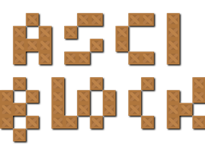

# ASCII-BLOCK
  -----------
  
  v1.0.0
 
## DEFINICIÓN
   ----------
  Emula un '**Pseudo-Pacman**' en 3D, dónde además de jugar y divertirse, se pueden diseñar niveles propios he incluso diferenciar los tipos de objetos utilizados mediante texturas personalizadas.  
  
  Lo interesante es que esto le da al juego un carácter creativo, no sólo lúdico. Al crear niveles propios estamos construyendo un mundo virtual personalizado donde es más divertido jugar y las posibilidades y dificultad la marcamos nosotros mismos.  
  Está pensado para uno o dos jugadores, esto depende del diseño del nivel; también he incluido un pequeño menú de **botonera** en el display para las opciones principales. Además contamos con distintos efectos visuales y sonidos. 
  
  > Este juego se ha programado enteramente con código *JS (Unity)*. Contiene un conversor (*parser*) de caracteres de texto a bloques gráficos.  
  
## UTILIZACIÓN
   -----------
   El juego es un binario ejecutable (exe) para Windows. Se encuentra en la carpeta 'WinExe' y como ejemplo he incluido un archivo de niveles 'levels.lvl', por supuesto totálmente modificable, y una carpeta 'Textures'; ambos opcionales.
  
## ESCENARIO
   ----------
   El escenario es un mundo virtual de **plataformas** en *3D* con limitación de sus dimensiones, donde si nos salimos de la plataforma morimos al caernos al vacío. El punto de vista es en **perspectiva** (por defecto), con la cámara en **3ª persona** y un tanto retirada de cada player.  
   
   Existe un panel frontal informativo con la *puntuación* y un cielo de fondo. El display pude particionarse si existen dos jugadores en el nivel, manejando sus cámaras independientemente.  También se muesta información en el display de cada jugador y una pequeña botonera con acciones como '*regresar el menú de niveles*', '*desconectar el sonido*', '*manejar el zoom*', '*cambiar a cámara zenital*' o '*salir del juego*'.
   
   Con el ratón podemos girar el punto de vista he incluso aplicar **zoom**. También existen teclas de atajos con funciones especiales como '*resetear el zoom*', '*resetear la inclinación de la cámara*', '*cambio de visión*', '*cámara zenital*', ...
  
## OBJETIVO
   --------
  Como ya he comentado es simple, un 'Pseudo-**Pacman**' dentro de un laberinto donde para superar el nivel se deben comer todos los *puntitos* (o las *supermonedas energéticas*) además de sortear al enemigo cuando se encuentra en modo '*killer*' (Rojo). Como en el original, al comer una moneda energizada (las grandes) contamos con un lapso de tiempo en el que podemos comernos al enemigo (Azul).  
  
  Contamos con una *pantalla de inicio, un menú de niveles y las propias pantallas de cada nivel*. 

>Para seleccionar un nivel concreto debemos introducirnos dentro del **Screen** de la recreativa de '*pac-manía*' (no me digas que no es original ¿eh?).
  
## NUEVOS NIVELES
   --------------
   Pueden crearse nuevos niveles insertando un archivo de texto **levels.lvl** en la carpeta raiz del juego. Este archivo utiliza una sintaxis propia para definir cada tipo de bloque y elemento del juego como son los enemigos, player, muros, monedas, ...
   
### SÍNTAXIS
   - Los niveles deben terminar con un caracter de control '*línea baja*' (**_**) para que el programa los tenga en cuenta; en una línea solitaria (sin más caracteres).
   - Cada línea de texto se corresponderá a una fila de bloques (excepto comentarios o caracteres de control).
   - Máximo **35 filas** con un máximo de **35 columnas** cada una.  
    
 Comentarios = **/** ó **;**  
 Control     = **_** (*new level*)  
 Bloques:  
 +   bloque = **@**  
 +   player = **P**  
 +   enemy  = **E**  
 +   coin   = **C**  
 +   point  = **P**  
 +   special= **S**  
 +   empty  = ' ' (*space*)  
   
## TEXTURAS PERSONALIZADAS
   -----------------------
   De momento se permiten modificar texturas para *monedas, muros y objetos especiales* utilizando imágenes (formato *png, jpg, gif o bmp*) con los siguientes nombres claves: **coin**, **wall** y **special**. Estas deben incluirse en una carpeta de nombre igual al número de nivel a personalizar, y todas ellas dentro de otra carpeta **Textures** alojada en el directorio raiz del juego.
   
   La ruta desde el ejecutable podría ser: `'Textures/3/coin.png', 'Textures/5/wall.jpg', ...` Aunque también se admite una carpeta **Default**' que actuaría como base para niveles no especificados.
 
## TECLAS ESPECIALES
   -----------------
   Con el ratón podemos girar el punto de vista, como si girásemos el cuello, he incluso aplicar zoom.
   
   - **Alt**: Resetea el ángulo de inclinación.
   - **Shift-Izdo**: Resetea el nivel de zoom.
   - **Backspace**: Cambio de cámara: Perspectiva u Ortográfica.
   - **Enter**: Cámara zenital.
   
   Además en el propio display contamos con botoneras (pensado para pantallas táctiles) para alguna de estas y otras acciones.
 
---------------------------

author: Juan José Guerra Haba <dinertron@gmail.com> &trade; GuerraTron-18 
email: [dinertron]
web: [guerratron]

[//]: # (These are reference links used in the body of this note and get stripped out when the markdown processor does its job. There is no need to format nicely because it shouldn't be seen. Thanks SO - http://stackoverflow.com/questions/4823468/store-comments-in-markdown-syntax)

   [dinertron]: <mailto:dinertron@gmail.com>
   [guerraTron]: <http://github.guerratron.io/>
